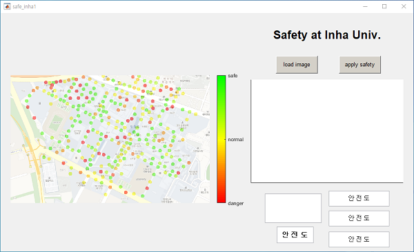
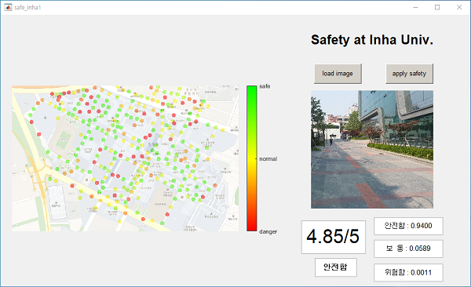
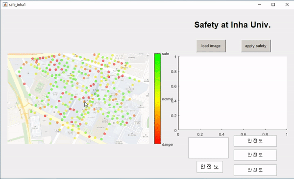

# StreetScore
StreetScore with street classification

## Introduction
We train AlexNet with four types of the street(Broad street, Construction site, Unpaved street, Street with many people). We make a dataset by capturing 4,868 images from Daum Kakao road view. After we got the classification results, we use that for pedestrian safety scoring. Score metric is as follows,

## Street Score
### GUI-matlab

## Prerequisites
* matlab
* tensorflow
* OpenCV
